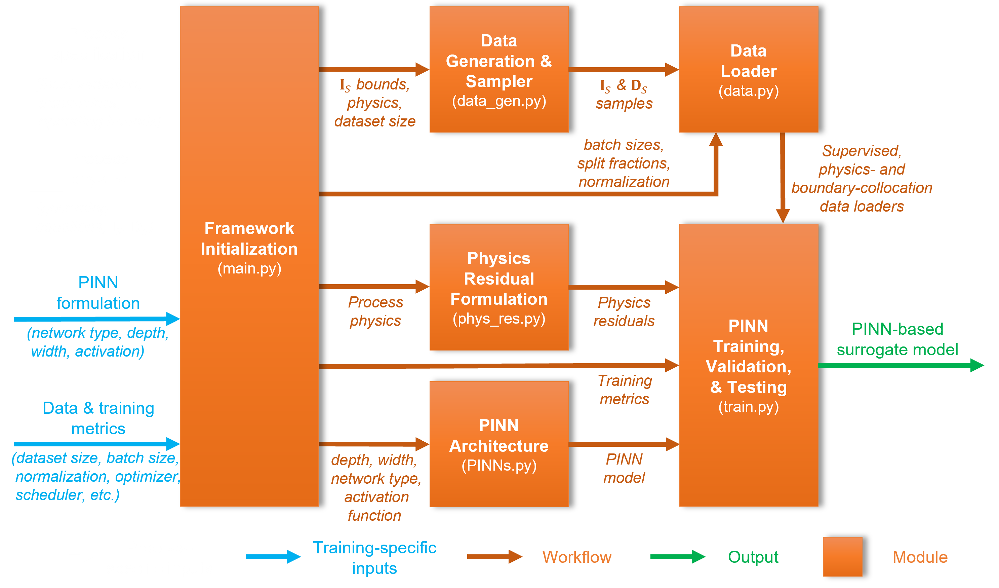

# pinnse: Physics-Informed Neural Networks for Process Systems Engineering


`pinnse` is a modular PyTorch framework for developing physics-informed neural network (PINN) surrogate models for chemical process modeling, simulation, and process systems engineering. The package separates process-specific information—such as operating bounds, governing equations, input-output formulations, and residual definitions—from reusable learning infrastructure for data handling, normalization, neural-network construction, training, validation, testing, and visualization.

The repository includes representative case studies for nonideal flash separation, isothermal plug-flow reactors under multiple surrogate formulations, inverse PINNs for parameter estimation, and a nonisothermal plug-flow reactor with coupled mass and energy balances.

<p align="center">
  
</p>

## Why pinnse?

PINN implementation in chemical engineering is often problem-specific: the governing equations, normalization choices, collocation sampling, boundary conditions, loss functions, and training logic are frequently hard-coded for one process. `pinnse` provides a reusable workflow in which the user supplies the process specification and residual equations, while the package manages the common PINN machinery.

Key capabilities include:

- supervised and physics-informed surrogate training,
- data, physics-collocation, and boundary-collocation loaders,
- Latin hypercube sampling for bounded variables,
- Dirichlet sampling for composition variables with prefixes `Z_`, `X_`, or `Y_`,
- feedforward, softplus-output, branched, and Fourier-feature neural networks,
- Adam and optional LBFGS optimization,
- physics and boundary residual weighting,
- adaptive weight tracking based on gradient norms,
- checkpointing using validation loss,
- training-history export to Excel/CSV, and
- standardized loss, weight, gradient, and inverse-parameter plots.

## Framework overview

The workflow begins in `main.py`, where the user defines four categories of inputs:

1. **Process specification**: fixed variables, process parameters, operating ranges, and admissible bounds.
2. **Process physics**: governing equations and the selected surrogate input-output representation, denoted by independent variables `I_S` and dependent variables `D_S`.
3. **PINN formulation**: network type, depth, width, activation function, residual definitions, and boundary conditions.
4. **Data and training metrics**: dataset sizes, collocation sizes, batch sizes, train/validation/test split, optimizer, scheduler, epochs, and loss weights.

These inputs drive five reusable stages:

| Stage | Typical file | Role |
|---|---:|---|
| Data generation and sampling | `data_gen.py` | Generate or load labeled `I_S`/`D_S` samples from a simulator or first-principles model. |
| Data loading | `pinnse/data.py` | Build supervised, physics-collocation, and boundary-collocation PyTorch loaders. |
| PINN architecture | `pinnse/PINNs.py` | Construct neural-network surrogate models. |
| Physics residual formulation | `phys_res.py` | Evaluate governing-equation and boundary residuals at collocation points. |
| Training, validation, and testing | `pinnse/train.py` | Optimize the combined data, physics, and boundary loss and save the trained surrogate. |

The total training objective is

```math
\mathcal{L}_{T}=\mathcal{L}_{D}+\lambda_{P}\mathcal{L}_{P}+\lambda_{B}\mathcal{L}_{B},
```

where `D`, `P`, and `B` denote data, physics, and boundary losses, respectively.

## Installation

Clone the repository and install the package in editable mode:

```bash
cd pinnse
python -m pip install --upgrade pip
python -m pip install -e .
```

The example scripts also use common scientific-Python utilities:

```bash
python -m pip install matplotlib scikit-learn openpyxl
```

For GPU training, install the PyTorch build that matches your CUDA version. Flash data generation through Aspen Plus requires Windows, Aspen Plus, and `pywin32`; the provided flash datasets can be used without Aspen.

```bash
python -m pip install pywin32  # only needed for Aspen COM-based data generation
```

## Repository structure

```text
pinnse/
├── pinnse/                    # reusable package
│   ├── PINNs.py               # ANN, SANN, BranchedANN, Fourier_ANN
│   ├── data.py                # labeled, physics-collocation, and boundary loaders
│   ├── train.py               # Adam/LBFGS training, validation, checkpointing
│   ├── utils.py               # normalization, denormalization, analysis, saving
│   └── plots.py               # training-history visualization
│
├── flash/
│   ├── case1/                 # flash surrogate: T, P, z -> VF, y, x
│   ├── case2/                 # flash surrogate with feed state, flowrate, and duty
│   └── Aspen Simulations/     # Aspen Plus files for data generation
│
├── isopfr/
│   ├── efm/                   # effluent-flow formulation
│   ├── erm/                   # extent-of-reaction formulation
│   ├── cm/s0/                 # conversion formulation
│   ├── cm/s1/                 # conversion formulation with scheduler variant
│   └── efm.inverse/           # inverse PINN for kinetic-parameter estimation
│
├── nonisopfr/                 # nonisothermal PFR example
├── pyproject.toml
├── LICENSE
└── README.md
```

## Quick start

Each example directory is self-contained and includes pre-generated `I_S_data.xlsx` and `D_S_data.xlsx` files.

```bash
cd isopfr/efm
python main.py
python check.py
```

The default examples are configured for research-scale training. For a quick smoke test, reduce the number of epochs in `main.py` before running.

Training creates outputs such as:

```text
logs/best_model.pth          # best validation checkpoint
logs/training_history.xlsx   # loss and diagnostic histories
logs/csv_files/              # CSV export of histories
figures/                     # training and validation plots
```

## Minimal usage pattern

A typical `pinnse` workflow has the following structure:

```python
import torch
import torch.nn as nn
import pandas as pd

from pinnse import ANN, DataModule, Normalization, Training, Save, Plotter
from phys_res import Physics, Boundary  # user-defined residual classes

I_S_data = pd.read_excel("I_S_data.xlsx")
D_S_data = pd.read_excel("D_S_data.xlsx")

I_S_norm, I_S_metrics = Normalization.min_max(I_S_data)
D_S_norm, D_S_metrics = Normalization.min_max(D_S_data)

data = DataModule(
    I_S_data=I_S_norm,
    D_S_data=D_S_norm,
    labeled_data_batch_size=500,
    physics_coll_data_size=20000,
    physics_coll_batch_size=500,
    boundary_coll_data_size=5000,
    boundry_coll_batch_size=1000,
    test_frac=0.1,
    val_frac=0.1,
)

train_loader, val_loader, test_loader = data.labeled_data_loader()
phys_coll_loader = data.phys_colloc_loader()
bnd_coll_loader = data.bnd_colloc_loader()

model = ANN(
    layer_size=[I_S_norm.shape[1], 64, 64, 64, D_S_norm.shape[1]],
    activation=nn.Tanh,
)

device = torch.device("cuda" if torch.cuda.is_available() else "cpu")
model = model.to(device)

physics = Physics(I_S_metrics, D_S_metrics)
boundary = Boundary()

trainer = Training(
    model=model,
    train_loader=train_loader,
    val_loader=val_loader,
    test_loader=test_loader,
    phys_coll_loader=phys_coll_loader,
    bnd_coll_loader=bnd_coll_loader,
    phys_residual=physics,
    bnd_residual=boundary,
    optimizer=torch.optim.Adam(model.parameters(), lr=1e-4),
    loss_fn=nn.MSELoss(),
    device=device,
    phys_weight=1.0,
    bnd_weight=1.0,
    ckpt_path="./logs/best_model.pth",
)

history = trainer.adam_step(epochs=10000, val_every=100)
Save.excel(history)
Plotter(history, val_every=100).plot_everything(savepath="figures")
```

`phys_residual` and `bnd_residual` must be callable objects with signature

```python
residual = residual_function(x, y)
```

where `x` is the normalized input tensor, `y` is the normalized model prediction, and the returned tensor contains residual values whose mean-squared value defines the physics or boundary loss.

## Included examples

| Directory | Process | Inputs | Outputs | Main purpose |
|---|---|---|---|---|
| `flash/case1` | Nonideal flash | `T_flash`, `P_flash`, `Z_i` | `VF`, `Y_i`, `X_i` | Equilibrium surrogate with material-balance and summation residuals. |
| `flash/case2` | Nonideal flash | `T_flash`, `P_flash`, `T_feed`, `P_feed`, `F`, `Z_i` | `VF`, `Y_i`, `X_i`, `Q` | Flash surrogate including feed state, flowrate, and heat duty. |
| `isopfr/efm` | Isothermal PFR | `F_in_i`, `P`, `T`, `V` | `F_ot_i` | Effluent-flow formulation. |
| `isopfr/erm` | Isothermal PFR | `F_in_i`, `P`, `T`, `V` | `E_Rj` | Extent-of-reaction formulation. |
| `isopfr/cm/s0` | Isothermal PFR | `F_in_i`, `P`, `T`, `V` | `X_Rj` | Conversion formulation. |
| `isopfr/cm/s1` | Isothermal PFR | `F_in_i`, `P`, `T`, `V` | `X_Rj` | Conversion formulation with scheduler variant. |
| `isopfr/efm.inverse` | Isothermal PFR | `F_in_i`, `P`, `T`, `V` | `F_ot_i` and trainable parameters | Joint state prediction and kinetic-parameter estimation. |
| `nonisopfr` | Nonisothermal PFR | `F0_A`, `C0_A`, `T0`, `Ta0`, `V` | `F_i`, `C_i`, `T`, `Ta` | Coupled species, reactor-energy, and coolant-energy balances. |

## Building a new process model

To add a new chemical-engineering system:

1. Create a new case directory with `main.py`, `data_gen.py`, `phys_res.py`, and optional `check.py`.
2. Define the surrogate input variables `I_S` and output variables `D_S` through system-variable analysis.
3. Generate labeled data using a simulator, numerical solver, experimental dataset, or validated first-principles model.
4. Normalize `I_S` and `D_S` using `Normalization` utilities or a custom scaling appropriate for the governing equations.
5. Implement `Physics` and, if needed, `Boundary` classes in `phys_res.py`.
6. Use `DataModule`, one of the neural-network architectures in `PINNs.py`, and `Training` to train the model.
7. Validate the trained surrogate against simulator or first-principles predictions using `check.py` or `Analyze` utilities.

Recommended residual-development practice is to denormalize variables inside `phys_res.py`, evaluate the governing equations in dimensional form, and scale residuals to comparable magnitudes before computing the physics loss.

## Data conventions

`pinnse` assumes tabular surrogate datasets:

- `I_S_data.xlsx`: independent surrogate inputs,
- `D_S_data.xlsx`: dependent surrogate outputs.

Composition variables should use prefixes such as `Z_`, `X_`, or `Y_`; these are sampled with Dirichlet distributions during physics-collocation generation so that each composition group remains on the simplex. For boundary collocation, `DataModule.bnd_colloc_loader()` fixes the last input column to the specified boundary value, which is convenient for reactor-coordinate boundaries such as `V = 0`.

## Citation

If you use `pinnse` in academic work, please cite the associated manuscript once available. Citation information will be added here upon publication.

## License

`pinnse` is released under the MIT License. See [`LICENSE`](LICENSE) for details.

## Contact

Maintainer: Harshit Verma  
Email: <harshit.verma.che@gmail.com>
